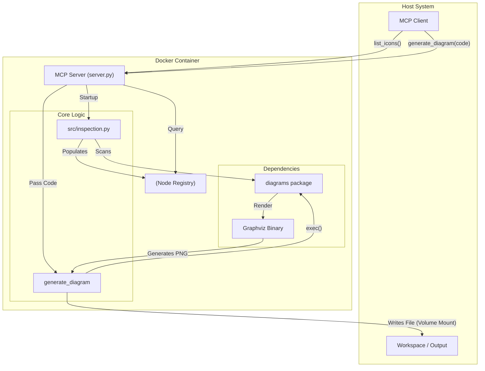

# Diagrams MCP Server

This is a Model Context Protocol (MCP) server that exposes the capabilities of the [Diagrams](https://diagrams.mingrammer.com/) Python library. It allows AI agents to discover available diagram nodes (AWS, Azure, K8s, etc.) and generate architectural diagrams from Python code.

## Architecture



## Features

- **Dynamic Icon Discovery**: `list_icons` tool scans the `diagrams` library to find all available nodes (e.g., `EC2`, `Pod`, `BlobStorage`) organized by provider and service.
- **Diagram Generation**: `generate_diagram` tool accepts Python code (DSL) and renders it into an image (PNG).
- **Examples**: `get_diagram_examples` tool provides ready-to-use snippets for common patterns.
- **Sandboxed Execution**: Runs inside a Docker container to ensure isolation and consistent dependencies (Graphviz).

## Prerequisites

- **Docker**: This server is designed to run as a Docker container to manage system dependencies like Graphviz.

## Build

Build the Docker image from the `mcp-server` directory:

```bash
cd mcp-server
docker build -t diagrams-mcp:latest .
```

## Configuration

To use this server with an MCP client (like Gemini CLI or Claude Desktop), add the following configuration.

This configuration mounts the current project directory into the container, allowing the server to save the generated images directly to your workspace.

```json
{
  "mcpServers": {
    "diagrams": {
      "command": "sh",
      "args": [
        "-c",
        "export PROJECT_PATH=\"$\(PROJECT_PATH:-$(pwd)\")\"; docker run -i --rm -v \"$PROJECT_PATH:$PROJECT_PATH\" -w \"$PROJECT_PATH\" diagrams-mcp:latest"
      ],
      "env": {
        "FASTMCP_LOG_LEVEL": "ERROR"
      }
    }
  }
}
```

### Explanation of the Command

- **`docker run -i --rm`**: Runs the container interactively (for stdin/stdout communication) and removes it after exit.
- **`-v "$PROJECT_PATH:$PROJECT_PATH"`**: Mounts the project root (where you invoke the agent) to the same path inside the container. This is crucial for the `generate_diagram` tool to write the output image file back to your host filesystem.
- **`-w "$PROJECT_PATH"`**: Sets the working directory inside the container to match the host, ensuring relative paths work as expected.
- **`diagrams-mcp:latest`**: The name of the image you built.

## Tools

### `list_icons`
Lists available icons/nodes from the diagrams package.
- **Inputs**: `provider_filter` (optional), `service_filter` (optional).
- **Example**: List all AWS compute nodes.

### `generate_diagram`
Generates a diagram from Python code.
- **Inputs**: `code` (Python DSL), `filename` (optional), `timeout` (default: 90s).
- **Example Code**:
  ```python
  from diagrams import Diagram
  from diagrams.aws.compute import EC2

  with Diagram("Simple", show=False):
      EC2("web")
  ```

### `get_diagram_examples`
Returns example code snippets.
- **Inputs**: `diagram_type` (e.g., "aws", "k8s").

## Development Structure

```text
mcp-server/
├── Dockerfile          # Container definition (Python + Graphviz)
├── requirements.txt    # Python deps
├── README.md           # This file
└── src/
    ├── server.py       # Main MCP server entrypoint
    └── inspection.py   # Helper for dynamic node discovery
```

## Autor

- **Autor**: Carlos Barbero
- **User**: carlosrgomes
